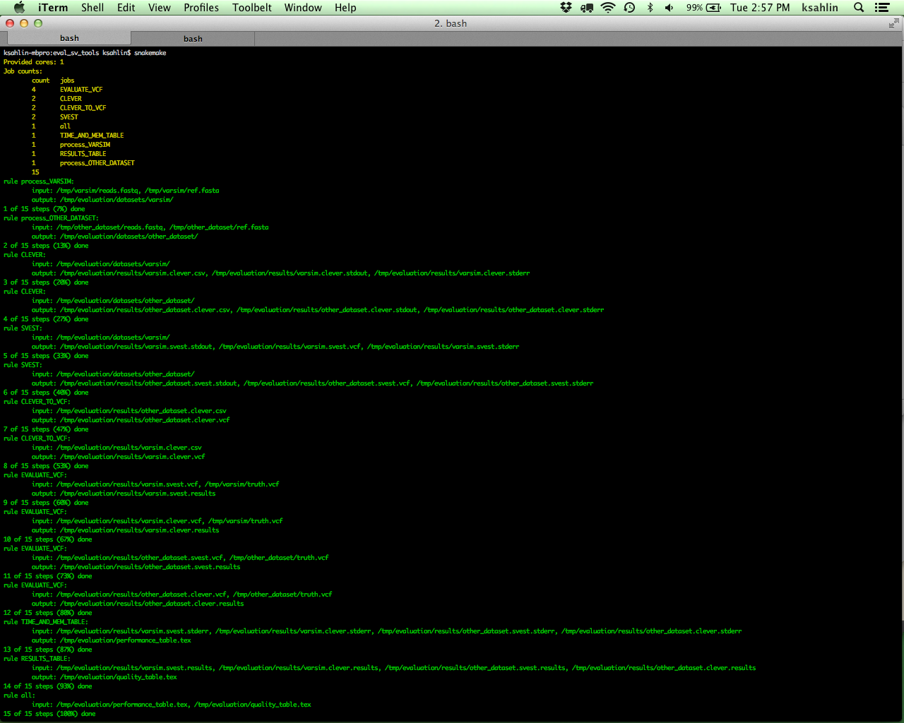

# eval_sv_tools

This evaluation pipeline uses [snakemake](https://bitbucket.org/johanneskoester/snakemake/wiki/Home), that requires python 3.x. Since most systems default to python2.X virtualenvs is the most convenient solution. 

### Installation
Install [pyenv](https://github.com/yyuu/pyenv) on uppmax (reccomended by UPPMAX as the default python virtual envirionment anyway) through the automatic installer [pyenv-installer](https://github.com/yyuu/pyenv-installer).

Then run 

    $ pyenv install 3.4.1

Now you have python 3.4.1 available through pyenv. 

### Running snakemake

In the current shell, run

    $ pyenv shell 3.4.1

to activate python 3 in the current shell. Now run,

    $ snakemake

This will create output

To see a flowchart of the pipeline, run 

    $ snakemake --dag | dot -Tpdf > dag.pdf

Current pipline:

